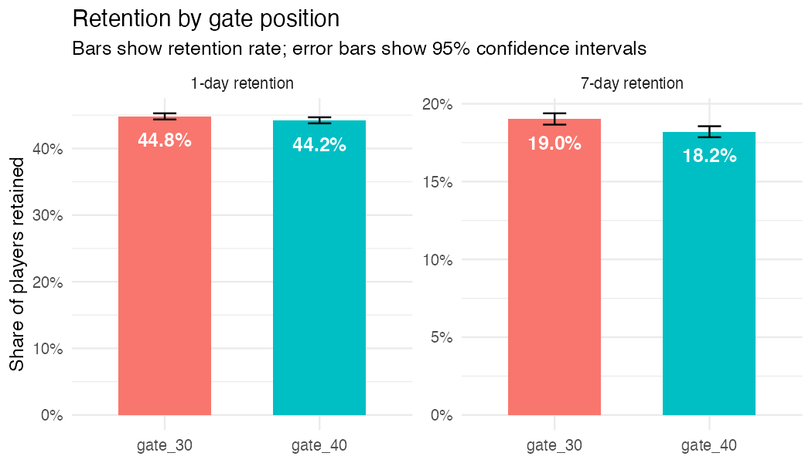
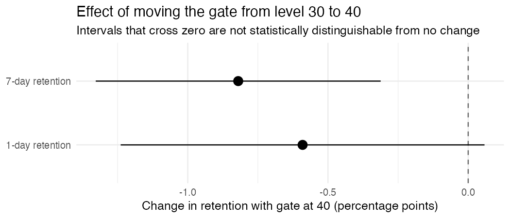

# ab-test-mobile-game-retention
A/B test analysis of a mobile game's gate placement and its effect on player retention, using R, SQL, and statistical testing.

Cookie Cats A/B Test: Should the First Gate Move from Level 30 to Level 40?

An analysis of a public mobile-game A/B test, written in R with SQL queries. This is a portfolio project using a publicly available teaching dataset, not data from a company I worked with.

## Recommendation

Keep the first gate at level 30. Moving it to level 40 did not improve retention. 1-day retention was 0.6 percentage points lower (44.2% vs 44.8%), which is not statistically significant (p = 0.074). 7-day retention was 0.8 percentage points lower (18.2% vs 19.0%; 95% CI −1.33 to −0.31 pp; p = 0.0016), which is significant even after correcting for testing two metrics. That is roughly a 4% relative drop in 7-day retention, which could add up across a large player base. Because this analysis only covers retention, I can't rule out that the later gate helps revenue or engagement in other ways, so before deciding I would want monetization data and ideally a longer test. The small imbalance in group sizes (p = 0.009) is worth raising with the team that ran the test, but at under 1% it is unlikely to explain the retention gap.

## Background

- Cookie Cats is a "connect three" puzzle game. As players progress, they hit gates that force them to wait or pay to continue. When players installed the game, (according to the dataset description), players were randomly assigned to one of two versions when they installed the game
- gate_30: first gate at level 30 (the original)
- gate_40: first gate moved to level 40

## Question: 
Does moving the gate to level 40 change player retention?

## Data: 
Mobile Games A/B Testing – Cookie Cats (Kaggle). 90,189 players, with game rounds played in the first 14 days and whether each player returned 1 day and 7 days after install. The data file is not included in this repo; download it from the link above and save it as cookie_cats.csv.

## Methods
1. Checked the data for missing values and loaded it into an in-memory SQL database to compute group sizes, retention rates, and average game rounds.
2. Flagged an extreme outlier (one player with 49,854 rounds; the next highest is 2,961). Retention is a yes/no outcome per player, so it doesn't affect the retention tests, but it inflated average rounds in gate_30. Without that player, average rounds are about 51.3 in both groups.
3. Compared retention between versions with a two-proportion z-test and 95% confidence intervals.
4. Because two metrics were tested, applied a Bonferroni-adjusted threshold (0.05 / 2 = 0.025).
5. Checked whether the group sizes were consistent with a 50/50 split.

## Results
- Metric	gate_30	gate_40	Difference	95% CI	p-value
- 1-day retention	44.82%	44.23%	−0.59 pp	(−1.24, +0.06)	0.074
- 7-day retention	19.02%	18.20%	−0.82 pp	(−1.33, −0.31)	0.0016
- 1-day retention: the difference is not statistically significant.
- 7-day retention: the difference is significant, even at the adjusted threshold of 0.025. It is about a 4% relative drop.
- Group sizes: 44,700 (gate_30) vs 45,489 (gate_40). A chi-squared test against a 50/50 split gave p = 0.0086. The imbalance is under 1%, but it is slightly larger than chance alone would predict, and I can't verify how players were assigned.

## Limitations

- Only retention was measured. There is no revenue or in-app purchase data, so this analysis can't speak to monetization.
- The effect is small in absolute terms (under 1 percentage point).
- The test duration isn't documented.
- Retention at 1 and 7 days doesn't show longer-term behavior.

## Files

- ab-test-project.R: full analysis (SQL queries, statistical tests, charts)
- retention_chart.png, difference_chart.png: output charts

## How to reproduce

1. Download the dataset from Kaggle and save it as cookie_cats.csv in the same folder as the script.
2. Install the R packages: install.packages(c("DBI", "RSQLite", "ggplot2", "scales"))
3. Run ab-test-project.R. It saves both charts to the same folder.
